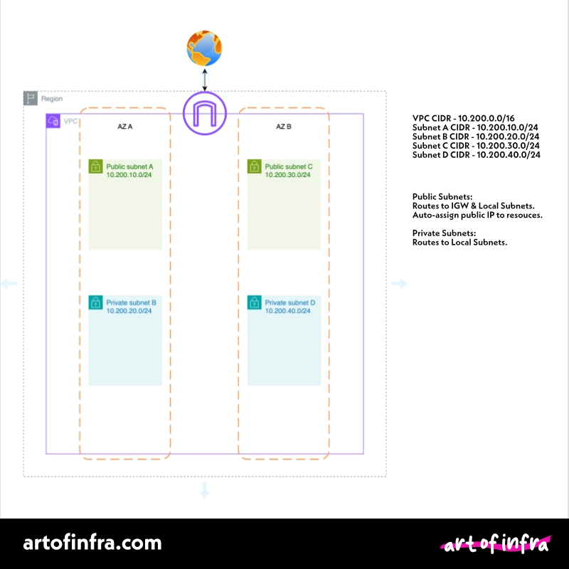

# Single VPC for Art of Infra Blog Demos

You'll find in this folder an AWS CloudFormation template for a single VPC setup that we will standardise on across all demo's, unless variations are called for. 

This provides a simple setup to follow along to with our [blog posts](https://artofinfra.com).

[Single VPC CloudFormation Template](single-vpc.yaml)

## What this CloudFormation Template Creates:
- A single VPC with the CIDR block 10.200.0.0/16
- 1 public and 1 private subnet in 2 AZ's (First two available)
- Internet Gateway and attaches to VPC
- Routing for public subnet traffic to IGW and local subnets.
- Routing for private subnet traffic to all local subnets. 
- Enables auto-assignment of public IPv4 addressing to resources placed in public subnets.

- Subnet A - Public - 10.200.10.0/24
- Subnet B - Private - 10.200.20.0/24
- Subnet C - Public - 10.200.30.0/24
- Subnet D - Private - 10.200.40.0/24

